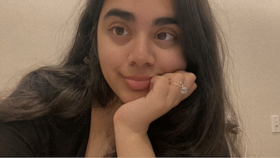

#  *Aalya : A glimpse into my world*
## About me 💁‍♀️ 
 
 Hi everyone 🥰 I'm Aalya, a third-year psychology student at Dalhousie University. I’m stoked to be diving into this coding course, even though it’s a bit scary. I’m ready to challenge myself and see what I can do! Here's a picture of me 🌝
 
 
 *** 
 ## Why Psychology? 🧠
Growing up in a society where mental health wasn't openly discussed, I developed a deep empathy for those struggling with anxiety and depression. This sparked my interest in psychology and my desire to help others navigate these challenges. 
***
## Why this Course?
I've always been curious about technology, and I think learning to code will be a great way to challenge myself and expand my skills. As a psychology student, I believe it will also be a valuable asset if I do plan to do research 🧐
***
## Career Goals 📚
While my long-term career goals may evolve, I'm excited to see where this degree takes me. In the meantime, I'm looking forward to gaining research experience and exploring different opportunities within the field of psychology.
***
## Personal Interests 🎨
When I’m not glued to my textbooks , you’ll probably find me hanging out with my two cats, exploring nature, or unleashing my inner artist. I’m also a total foodie 😋 and love trying out new restaurants with my friends. Nothing beats a good game night with my friends or a relaxing day at the beach 🌊

